# Диаграмма классов бэкенда

## Архитектура бэкенда

```mermaid
classDiagram
    class FastAPI {
        +app: FastAPI
        +add_middleware()
        +include_router()
    }

    class TablesRouter {
        +router: APIRouter
        +upload_table(file: UploadFile) Dict
        +list_tables() Dict
        +get_table(table_id: str) Dict
        +delete_table(table_id: str) Dict
        +get_pie_chart(table_id: str) Dict
        +check_reference_values(table_id: str, request: ReferenceCheckRequest) Dict
    }

    class DemoRouter {
        +router: APIRouter
        +download_file(demo_version: str) FileResponse
        +get_patients_list() List[Dict]
        +get_patient_data_by_id(patient_id: str) Dict
        +get_patients_list_from_test_table() List[Dict]
        +get_patient_data_from_test_table(patient_id: str) Dict
        +get_patient_data(demo_version: str) Dict
        +upload_patient_data(file: UploadFile) Dict
        +get_patients_list_from_uploaded() List[Dict]
        +get_patient_data_from_uploaded(patient_id: str) Dict
        -load_norms() Dict
        -get_test_category(test_code: str) str
        -check_value_against_norm(value: float, norm_min: float, norm_max: float) str
        -is_significantly_abnormal(value: float, norm_min: float, norm_max: float) bool
        -get_norm_info(test_code: str, test_name: str, norms: Dict) Dict
        -group_by_category(data: List[Dict], norms: Dict) Dict
        -get_abnormal_tests(data: List[Dict], norms: Dict) List[Dict]
        -prepare_chart_data(data: List[Dict], norms: Dict) Dict
        -map_test_short_to_code(test_short: str, norms: Dict) str
    }

    class StorageService {
        +STORAGE: Dict[str, Dict]
        +save_table(table_data: Dict) str
        +get_table(table_id: str) Optional[Dict]
        +get_all_tables() Dict
        +delete_table(table_id: str) bool
        +update_table(table_id: str, table_data: Dict) bool
    }

    class AnalyticsService {
        +process_table(table_data: Dict) Dict
        +get_pie_chart_data(table_data: Dict) Dict
    }

    class FileParser {
        +parse_csv(file_content: bytes) Dict
        +parse_json(file_content: bytes) Dict
        +parse_excel(file_content: bytes) Dict
        +parse_new_json_format(data: Dict) Dict
        +dataframe_to_dict(df: DataFrame) Dict
        +dict_to_dataframe(table_dict: Dict) DataFrame
        +wide_format_to_json_format(table_dict: Dict) Dict
        +json_format_to_wide_format(json_data: Dict) Dict
    }

    class PreprocessingModule {
        +preprocess_json(data: Union[Dict, str], remove_empty: bool, remove_duplicates: bool, remove_outliers: bool) Tuple[Dict, Dict]
        +remove_empty_and_duplicates(data: Union[Dict, str]) Tuple[Dict, Dict]
        +remove_outliers_3sigma(data: Union[Dict, str]) Tuple[Dict, Dict]
    }

    class NameEnrichmentModule {
        +process_json(data: Union[Dict, str], json_path: str, similarity_threshold: float) Dict
        +transliterate_cyrillic_to_latin(text: str) str
        +normalize_column_name(name: str) str
        +cluster_similar_names(names: List[str], threshold: float) List[List[str]]
        +create_test_mapping(column_names: List[str], reference_data: List[Dict], threshold: float) Dict
    }

    class ReferenceCheckRequest {
        +test_names: List[str]
    }

    class PydanticBaseModel {
        <<abstract>>
    }

    FastAPI --> TablesRouter : includes
    FastAPI --> DemoRouter : includes
    TablesRouter --> StorageService : uses
    TablesRouter --> AnalyticsService : uses
    TablesRouter --> FileParser : uses
    TablesRouter --> PreprocessingModule : uses
    TablesRouter --> NameEnrichmentModule : uses
    TablesRouter --> ReferenceCheckRequest : uses
    DemoRouter --> StorageService : uses
    DemoRouter --> FileParser : uses
    ReferenceCheckRequest --|> PydanticBaseModel : extends
```



## Описание компонентов

### FastAPI (app/main.py)
Главное приложение FastAPI, которое:
- Настраивает CORS middleware
- Подключает роутеры для таблиц и демо
- Предоставляет корневой эндпоинт и health check

### TablesRouter (app/routers/tables.py)
Роутер для работы с таблицами:
- **upload_table**: Загружает и обрабатывает файлы (CSV, JSON, Excel)
- **list_tables**: Возвращает список всех загруженных таблиц
- **get_table**: Получает таблицу по ID
- **delete_table**: Удаляет таблицу по ID
- **get_pie_chart**: Генерирует данные для круговой диаграммы
- **check_reference_values**: Проверяет значения анализов на соответствие референсным значениям

### DemoRouter (app/routers/demo.py)
Роутер для демо-функционала:
- Работа с демо-файлами пациентов
- Загрузка и обработка данных пациентов
- Группировка анализов по категориям
- Определение отклонений от нормы
- Подготовка данных для графиков

### StorageService (app/services/storage.py)
Сервис для хранения таблиц в памяти:
- **save_table**: Сохраняет таблицу и возвращает ID
- **get_table**: Получает таблицу по ID
- **get_all_tables**: Возвращает все таблицы
- **delete_table**: Удаляет таблицу
- **update_table**: Обновляет существующую таблицу

### AnalyticsService (app/services/analytics.py)
Сервис для аналитики (заглушка):
- **process_table**: Обрабатывает таблицу через аналитику
- **get_pie_chart_data**: Генерирует данные для круговой диаграммы

### FileParser (app/utils/file_parser.py)
Утилиты для парсинга файлов:
- **parse_csv**: Парсит CSV файлы
- **parse_json**: Парсит JSON файлы (поддерживает новый и старый форматы)
- **parse_excel**: Парсит Excel файлы (.xlsx, .xls)
- **parse_new_json_format**: Парсит новый JSON формат с test_names и patients
- **dataframe_to_dict**: Конвертирует DataFrame в словарь
- **dict_to_dataframe**: Конвертирует словарь обратно в DataFrame
- **wide_format_to_json_format**: Конвертирует широкий формат в JSON формат
- **json_format_to_wide_format**: Конвертирует JSON формат обратно в широкий формат

### PreprocessingModule (analytics/back.py)
Модуль предобработки данных:
- **preprocess_json**: Основная функция предобработки
- **remove_empty_and_duplicates**: Удаляет пустые записи и дубликаты
- **remove_outliers_3sigma**: Удаляет выбросы по правилу трех сигм

### NameEnrichmentModule (analytics/name_of_analysis.py)
Модуль обогащения данных названиями анализов:
- **process_json**: Основная функция обогащения
- **transliterate_cyrillic_to_latin**: Транслитерация кириллицы
- **normalize_column_name**: Нормализация названий колонок
- **cluster_similar_names**: Кластеризация похожих названий
- **create_test_mapping**: Создание маппинга тестов

### ReferenceCheckRequest
Pydantic модель для запроса проверки референсных значений:
- **test_names**: Список названий анализов для проверки

## Поток данных

1. **Загрузка файла**:
   ```
   Client → TablesRouter.upload_table → FileParser → 
   PreprocessingModule → NameEnrichmentModule → 
   AnalyticsService → StorageService
   ```

2. **Получение таблицы**:
   ```
   Client → TablesRouter.get_table → StorageService
   ```

3. **Демо данные пациента**:
   ```
   Client → DemoRouter.get_patient_data → 
   FileParser → DemoRouter.group_by_category → 
   DemoRouter.get_abnormal_tests → DemoRouter.prepare_chart_data
   ```

## Зависимости

- **FastAPI**: Веб-фреймворк
- **Pydantic**: Валидация данных
- **Pandas**: Обработка таблиц
- **NumPy**: Математические операции
- **OpenPyXL/XLRD**: Чтение Excel файлов

